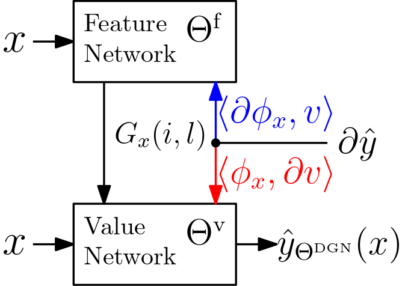
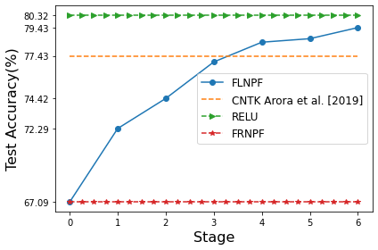

# Neural Path Features and Neural Path Kernel : Understanding the role of gates in deep learning

This repository is the official implementation for accepted paper: "Neural Path Features and Neural Path Kernel : Understanding the role of gates in deep learning" in NeurIPS 2020


<p align="center">

</p>


## Experiments

| Arch | Optimizer | Dataset | FRNPF(II) | FRNPF(DI) | DNFPL | FLNPF | ReLU |
| :--: | :-------: | :-----: | :-------: | :-------: | :---: | :---: | :--: |
| [FC](./code/sgd-mnist.ipynb) | SGD | MNIST | 95.85&plusmn;0.10 | 95.85&plusmn;0.17 | 97.86&plusmn;0.11 | 97.10&plusmn;0.09 | 97.85&plusmn;0.09 |
| [FC](./code/adam-mnist.ipynb) | Adam | MNIST | 96.02&plusmn;0.13 | 96.09&plusmn;0.12 | 98.22&plusmn;0.05 | 97.82&plusmn;0.02 | 98.14&plusmn;0.07 |
| [VCONV](./code/sgd-vconv-cifar10.ipynb) | SGD | CIFAR-10 | 58.92&plusmn;0.62 | 58.83&plusmn;0.27 | 63.21&plusmn;0.07 | 63.06&plusmn;0.73 | 67.02&plusmn;0.43 |
| [VCONV](./code/adam-vconv-cifar10.ipynb) | Adam | CIFAR-10 | 64.86&plusmn;1.18 | 64.68&plusmn;0.84 | 69.45&plusmn;0.76 | 71.40&plusmn;0.47 | 72.43&plusmn;0.54 |
| [GCONV](./code/sgd-gconv-cifar10.ipynb) | SGD | CIFAR-10 | 67.36&plusmn;0.56 | 66.86&plusmn;0.44 | 74.57&plusmn;0.43 | 78.52&plusmn;0.39 | 78.90&plusmn;0.37 |
| [GCONV](./code/adam-gconv-cifar10.ipynb) | Adam | CIFAR-10 | 67.09&plusmn;0.58 | 67.08&plusmn;0.27 | 77.12&plusmn;0.19 | 79.68&plusmn;0.32 | 80.32&plusmn;0.35 |

### [Continuous NPF Learning](./code/gconv_multi_step_copy_cifar10.ipynb)

<p align="center">

</p>
[Arora et al. 2019](https://arxiv.org/pdf/1904.11955.pdf) propse a pure kernel method named CNTK which achieves 77.43% test accuracy on cifar10 and is within 5-6% of the finite deep net architecture performace.
We trained Fixed NPF(FLNPF) network by copying gates from a standared ReLU network at the various stage of training. We found that as gates are learned, the performance of FLNPF improves and subsequently surpasses the CNTK.


## Citation

Please cite the paper if it helps you:

```angular2
@inproceedings{chandra2020npf,
    title={Neural Path Features and Neural Path Kernel : Understanding the role of gates in deep learning},
    author={Lakshminarayanan, Chandrashekar and Singh, Amit Vikram},
    booktitle={Advances in Neural Information Processing Systems(NeurIPS)},
    year={2020}
}
```
